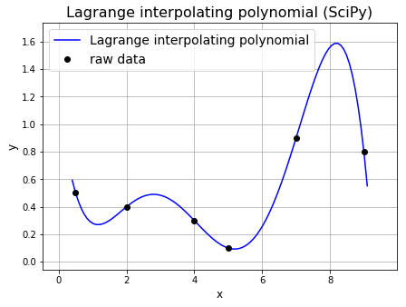

<p align="center">
  <a href="https://github.com/Imtjl/fp-interpolation-cli">
    <picture>
      
    </picture>
<h1 align="center">
  Лабораторная работа №3<br>
  (CLI-утилита для интерполяции)
</h1>

  </a>
</p>

<p align="center">  
 <a aria-label="Elixir Version" href="https://elixir-lang.org/">
  
</a>
<a aria-label="Erlang/OTP Version" href="https://www.erlang.org/">
  
</a>
<a aria-label="Elixir CI" href="https://github.com/Imtjl/fp-interpolation-cli/actions">
  
</a>
  <a aria-label="Coverage Status" href="https://coveralls.io/github/Imtjl/fp-interpolation-cli?branch=main">
    
  </a>
</p>
  
<details open>
   <summary><b>Table of Contents</b></summary>

- [Title](#title)
- [Architecture](#arch)
- [Conclusion](#end)

</details>

---

<a id="title"></a>

- Студент: `Дворкин Борис Александрович`
- Группа: `P3331`
- ИСУ: `368090`
- Функциональный язык программирования: `Elixir`

---

<a id="usage"></a>

## Использование

### Потоковый режим

> Шаг дискретизации `s` - step

```bash
╭─boris at fedora in ⌁/dev/functional-programming-course/fp-lab3 (main ✚5…2)
╰─λ cat ./resources/large_input_data.csv
  | ./interpolation_cli -a linear,lagrange -s 1.0
  > ./resources/large_output_data.md
```

### Ручной ввод

> Шаг дискретизации `s` - step

```bash
╭─boris at fedora in ⌁/dev/functional-programming-course/fp-lab3 (main ✚4…2)
╰─λ ./interpolation_cli -a linear,lagrange -s 1.0       130 (37.076s) < 14:21:11
0 0
1.571 1

Linear (going from point 0.0 with step 1.0, covering all input X (1.57 < 2.0))
:
0.0     1.0     2.0
0.0     0.64    1.27

3.142 0

Linear (going from point 1.57 with step 1.0, covering all input X (3.14 < 3.57))
:
1.57    2.57    3.57
1.0     0.36    -0.27

4.712 -1

Linear (going from point 3.14 with step 1.0, covering all input X (4.71 < 5.14))
:
3.14    4.14    5.14
0.0     -0.64   -1.27


Lagrange (from point 0.0 with step 1.0, covering all input X (4.71 < 5.0))
:
0.0     1.0     2.0     3.0     4.0     5.0
0.0     0.97    0.84    0.12    -0.67   -1.03

12.568 0

Linear (going from point 4.71 with step 1.0, covering all input X (12.57 < 12.71))
:
4.71    5.71    6.71    7.71    8.71    9.71    10.71   11.71   12.71
-1.0    -0.87   -0.75   -0.62   -0.49   -0.36   -0.24   -0.11   0.02


Lagrange (from point 1.57 with step 1.0, covering all input X (12.57 < 12.57))
:
1.57    2.57    3.57    4.57    5.57    6.57    7.57    8.57    9.57    10.57  11.57    12.57
1.0     0.37    -0.28   -0.91   -1.49   -1.95   -2.26   -2.38   -2.25   -1.84  -1.11    0.0
```

<a id="arch"></a>

## Архитектура

Модель акторов используется в модулях `Application`, `InputHandler`,
`LinearInterpolator`, `LagrangeInterpolator` и `OutputHandler`.

- **Supervisor** — центральный процесс, который управляет жизненным циклом
  дочерних процессов (`InputHandler`, `LinearInterpolator`,
  `LagrangeInterpolator` и `OutputHandler`). При сбоях `Supervisor`
  перезапускает только те процессы, которые завершились аварийно, используя
  стратегию `:one_for_one`.

- **GenServer** - это абстракция Elixir для реализации акторов. Это процесс,
  хранящий состояние и обрабатывающий запросы. По принципу своей работы это
  похоже на брокеров сообщений, по типу RabbitMQ или Kafka - по сути, просто луп
  эрланговского процесса, который ждёт сообщение, исполняет релевантный ему код,
  обновляет состояние если нужно и обратно возвращается в ожиданию сообщения.

Таким образом, для CLI она не нужна, т.к. это точка входа, не имеющая состояния,
которое можно было сохранить между вызовами, и оно не требует какого-то
параллельного взаимодействия.

В то время как остальные модули работают в изолированных процессах GenServer и
общаются между собой через асинхронные сообщения `cast` и `call`, что позволяет
избежать блокировки и синхронизации, а также компоненты могут обрабатывать
данные параллельно, независимо друг от друга. Например, OutputHandler может
вводить данные в то время, как InputHandler уже обрабатывает новую порцию
данных. Для другого алгоритма интерполяции можно просто добавить ещё один ген
сервер.

```
+--------------------------------------+
|                CLI                   |
|--------------------------------------|
| Чтение и парсинг ввода               |
| Запуск и настройка компонентов       |
| Передача точек в InputHandler        |
+--------------------------------------+
                    |
                    v
+--------------------------------------+
|           InputHandler               |
|--------------------------------------|
| (GenServer)                          |
| Приём данных и сортировка            |
| Хранение входных точек               |
| Передача точек в интерполяторы       |
+--------------------------------------+
                    |
                    v
+--------------------------------------+
|      Linear/Lagrange Interpolator    |
|--------------------------------------|
| (GenServer)                          |
| Линейная / полином Лагранжа          |
| Получение точек от InputHandler      |
| Генерация промежуточных точек        |
| Передача результатов в OutputHandler |
+--------------------------------------+
                    |
                    v
+--------------------------------------+
|           OutputHandler              |
|--------------------------------------|
| (GenServer)                          |
| Приём интерполированных данных       |
| Форматирование и вывод результатов   |
+--------------------------------------+
```

## Интерполяция

В моей программе реализованы два метода интерполяции: линейная и интерполяция с
помощью полинома Лагранжа. Оба метода выражены в виде математических формул и
реализованы на Elixir.

### Линейная интерполяция

Линейная интерполяция между двумя точками `(x_1, y_1)` и `(x_2, y_2)` выражается
как:

$$
y = y_1 + \frac{{y_2 - y_1}}{{x_2 - x_1}} \cdot (x - x_1)
$$

В Elixir реализация разбивает отрезок между двумя точками на заданные промежутки
с шагом `step`, а затем вычисляет значения по формуле для каждого промежуточного
`x`:

```elixir
def perform_linear_interpolation([{x1, y1}, {x2, y2}], step) do
  xs = Stream.iterate(x1, &(&1 + step)) |> Enum.take_while(&(&1 <= x2))
  ys = Enum.map(xs, fn x -> y1 + (y2 - y1) / (x2 - x1) * (x - x1) end)
  Enum.zip(xs, ys)
end
```

### Интерполяция полиномом Лагранжа

Интерполяция полиномом Лагранжа для набора точек
$(x_0, y_0), (x_1, y_1), \dots, (x_n, y_n)$ вычисляется с помощью полинома
степени \( n \):

$$
L(x) = \sum_{i=0}^{n} y_i \cdot l_i(x)
$$

где $l_i(x)$ — базисный полином, определяемый как:

$$
l_i(x) = \prod_{\substack{0 \leq j \leq n \\ j \neq i}} \frac{{x - x_j}}{{x_i - x_j}}
$$

Реализация на Elixir строит этот полином, используя функции для вычисления
значений каждого базисного полинома `l_i(x)`:

```elixir
def lagrange_value(points, x) do
  Enum.reduce(points, 0.0, fn {x_i, y_i}, acc ->
    acc + y_i * basis_polynomial(points, x, x_i)
  end)
end

defp basis_polynomial(points, x, x_i) do
  Enum.reduce(points, 1.0, fn {x_j, _}, prod ->
    if x_i != x_j do
      prod * (x - x_j) / (x_i - x_j)
    else
      prod
    end
  end)
end
```

<a id="end"></a>

## Вывод

Познакомился с математической моделью акторов, с её реализацией в Elixir,
порадовался как тут всё прикольно, нет проблем с бесконечными блокировками и
синхронизациями, ведь общение между Эрланговскими процессами происходит простыми
сообщениями, как в брокерах сообщений с которыми довелось работать, по типу
RabbitMQ и Kafka. Также интересна работа Супервизора - легко создать и наполнить
ген серверами, и в случае возникновения любого эксепшена не падает всё
приложение, а продолжает работу в штатном режиме. Стратегий супервизора не так
много и легко изучаются, язык прямо сделан для создания хорошей нагруженной
системы. Поигрался с обработкой сообщений и общением с супервизором. Модули для
работы с потоками I/O предоставляют достаточно интуитивный и простой интерфейс
для работы, поэтому было интересно и не слишком больно работать с потоковыми
режимами.
